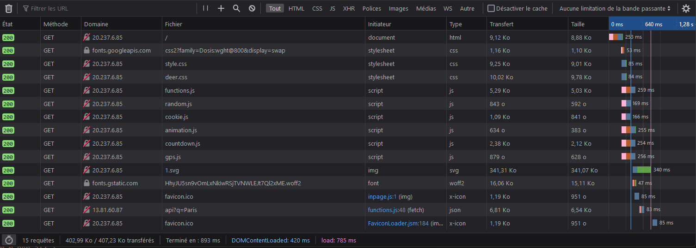
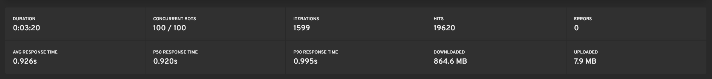
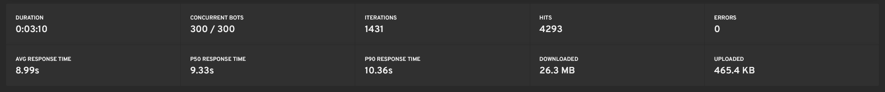

 Table of Content

- [Introduction](#introduction)
- [How to](#how-to)
- [Web Application](#web-application)
- [Server Application](#server-application)
- [Documentation](#documentation)
- [Load Testing](#load-testing)
  - [Website Load Testing](#website-load-testing)
  - [Server Load Testing](#server-load-testing)
  - [Database Load Testing](#database-load-testing)

    

# Introduction

This document will list all the tests that will be performed on the project. It will also list the test environment and the test schedule.
This document will keep track of all test and will be updated as the test are going.

# How to

This section will explain how to use this document.

**Accepted terms**

| **Test** | **Status** | **Description** | **Result** | **OS** | **Test Environment** | **Test Date** | **Tested By** | **Issue Link** | **Issue Description** | **Regression Test** | **Action taken** |
| --- | --- | --- | --- | --- | --- | --- | --- | --- | --- | --- | --- |
| ID | <ul> <li>PASS</li> <li>ERROR</li> </ul> | Description | Description | <ul> <li>Windows XX</li> <li>Mac OS XX</li> <li>IOS XX</li> <li>Android XX</li> </ul> | <ul> <li>Firefox</li> <li>Chrome</li> <li>Safari</li> <li>Samsung Internet</li> </ul> | YY - DD - MM | Name | [LINK](www.google.com) | Description | <ul> <li>YES</li> <li>NO</li> </ul> | Description |

**How**

This document have to be updated as the tests are going. The table will be updated with the test results.
In case of a regression test, the tests will have to be performed again and the **Test Date** will be updated.
In case of a test failure, the **Issue Link** will be updated with the link to the issue and the **Issue Description** will be updated with the description of the issue.
Issues are posted in **[Issues section](https://github.com/algosup/2022-2023-project-2-santa-time-Project-5-group/issues)** of the repository.
Issues are created by the QA team and assigned to the developer that have to fix the issue.
Issues have to respect the **Template** that is provided on Github.

# Web Application

| **Test** | **Status** | **Description** | **Result** | **OS** | **Test Environment** | **Test Date** | **Tested By** | **Issue Link** | **Regression Test** |
| --- | --- | --- | --- | --- | --- | --- | --- | --- | --- |
| 1 | <ul> <li>PASS after fix</ul> | When zooming out a white bar appear on the website | A white bar in the background that shouldn't be there | <ul> <li>Windows 11</li> <li>Mac OS 12</li></ul> | <ul> <li>Firefox</li> <li>Chrome</li></ul> | 24/11/2022 | Guillaume Riviere | / | <ul><li>NO</li> </ul> | The issue was fixed by removing a white pixel in the background image |
| 2 | <ul> <li>PASS after fix</li> </ul> | Cookie Text is should be readable | Text is readable on all device | Android 12 | Samsung Internet - Galaxy S10+ | 01/12/2022 | Guillaume Riviere | / | <ul> <li>NO</li> </ul> |
| 3 | <ul> <li>PASS</li> </ul> | Cookie Saving | Cookies are save correctly | <ul> <li>Android 12</li><li>IOS 16</li><li>MACOS 12</li><li>Windows 11</li></ul>   | <ul> <li>Firefox</li><li>Safari</li><li>Chrome</li><li>Samsung Internet</li></ul> | 01/12/2022 | Guillaume Riviere | / | <ul> <li>NO</li> </ul> |
| 4 | <ul> <li>PASS</li> </ul> | Cookie Pop up showing | Pop up appears correctly on page load | <ul> <li>Android 12</li><li>IOS 16</li><li>MACOS 12</li><li>Windows 11</li></ul>   | <ul> <li>Firefox</li><li>Safari</li><li>Chrome</li><li>Samsung Internet</li></ul> | 01/12/2022 | Guillaume Riviere | / | <ul> <li>NO</li> </ul> |
| 5 | <ul> <li>PASS</li> </ul> | Cookie pop up don't show if already accepted | The pop up isn't appearing if already accepted | <ul> <li>Android 12</li><li>IOS 16</li><li>MACOS 12</li><li>Windows 11</li></ul>   | <ul> <li>Firefox</li><li>Safari</li><li>Chrome</li><li>Samsung Internet</li></ul> | 01/12/2022 | Guillaume Riviere | / |  <ul> <li>NO</li> </ul> |
| 6 | <ul> <li>PASS</li> </ul> | Cookie Enter Adress in search Bar if exist | Adress is correctly placed in Search bar if it exist in cookies | <ul> <li>Android 12</li><li>IOS 16</li><li>MACOS 12</li><li>Windows 11</li></ul>   | <ul> <li>Firefox</li><li>Safari</li><li>Chrome</li><li>Samsung Internet</li></ul> | 01/12/2022 | Guillaume Riviere | / |  <ul> <li>NO</li> </ul> |
| 7 | <ul> <li>PASS</li> </ul> | Cookie Delete after 6 months | Cookies are deleted after 6 months | <ul> <li>Android 12</li><li>IOS 16</li><li>MACOS 12</li><li>Windows 11</li></ul>   | <ul> <li>Firefox</li><li>Safari</li><li>Chrome</li><li>Samsung Internet</li></ul> | 05/12/2022 | Guillaume Riviere | / |  <ul> <li>NO</li> </ul> |
| 8 | <ul> <li>PASS</li> </ul> | Cookie Display timer if cookie exist | Timer appear on Page load | <ul> <li>Android 12</li><li>IOS 16</li><li>MACOS 12</li><li>Windows 11</li></ul>   | <ul> <li>Firefox</li><li>Safari</li><li>Chrome</li><li>Samsung Internet</li></ul> | 05/12/2022 | Guillaume Riviere | / |  <ul> <li>NO</li> </ul> |
| 9 | <ul> <li>PASS</li> </ul> | Cookie Replace old adress if a new one is registered | Address is updated each times | <ul> <li>Android 12</li><li>IOS 16</li><li>MACOS 12</li><li>Windows 11</li></ul> | <ul> <li>Firefox</li><li>Safari</li><li>Chrome</li><li>Samsung Internet</li></ul> | 05/12/2022 | Guillaume Riviere | / |  <ul> <li>NO</li> </ul> |
| 10 | <ul> <li>PASS</li> </ul> | GPS Clicking on GPS button should return correct position  | Output correct approximate location ( GPS precision ) | <ul> <li>Android 12</li><li>IOS 16</li><li>Windows 11</li></ul> | <ul> <li>Firefox</li><li>Chrome</li><li>Samsung Internet</li></ul> | 05/12/2022 | Guillaume Riviere | / |  <ul> <li>NO</li> </ul> |
| 11 | <ul> <li>ERROR</li> </ul> | GPS Clicking on GPS button should return correct position  | Return nothing, no errors | <ul> <li>MACOS 12</li></ul> | <ul><li>Safari</li><li>Chrome</li><li>Firefox</li></ul> | 05/12/2022 | Guillaume Riviere |  [LINK](https://github.com/algosup/2022-2023-project-2-santa-time-Project-5-group/issues/30) | <ul> <li>YES</li> </ul> |
| 12 | <ul> <li>PASS</li> </ul> | Timer Real seconds  | Seconds are real seconds |  <ul> <li>Android 12</li><li>IOS 16</li><li>MACOS 12</li><li>Windows 11</li></ul> |  <ul> <li>Firefox</li><li>Safari</li><li>Chrome</li><li>Samsung Internet</li></ul> | 05/12/2022 | Guillaume Riviere | / |  <ul> <li>NO</li> </ul> |
| 13 | <ul> <li>PASS</li> </ul> | Timer Change on Adress Change | Timer is updated each time the address is updated |  <ul> <li>Android 12</li><li>IOS 16</li><li>MACOS 12</li><li>Windows 11</li></ul> |  <ul> <li>Firefox</li><li>Safari</li><li>Chrome</li><li>Samsung Internet</li></ul> | 05/12/2022 | Guillaume Riviere | / | <ul> <li>NO</li> </ul> |
| 14 | <ul> <li>PASS</li> </ul> | Link Partners | Link partners link correctly to the page Partners |  <ul> <li>Android 12</li><li>IOS 16</li><li>MACOS 12</li><li>Windows 11</li></ul> |  <ul> <li>Firefox</li><li>Safari</li><li>Chrome</li><li>Samsung Internet</li></ul> | 06/12/2022 | Guillaume Riviere | / | <ul> <li>NO</li> </ul> |
| 15 | <ul> <li>PASS</li> </ul> | Link Privacy | Link privacy link correctly to the page Privacy |  <ul> <li>Android 12</li><li>IOS 16</li><li>MACOS 12</li><li>Windows 11</li></ul> |  <ul> <li>Firefox</li><li>Safari</li><li>Chrome</li><li>Samsung Internet</li></ul> | 06/12/2022 | Guillaume Riviere | / | <ul> <li>NO</li> </ul> |
| 16 | <ul> <li>PASS after fix</li> </ul> | Link Privacy position | Link privacy go under the deer on small devices |  <ul> <li>Android 12</li><li>IOS 16</li></ul> |  <ul> <li>Firefox</li><li>Safari</li><li>Chrome</li><li>Samsung Internet</li></ul> | 06/12/2022 | Guillaume Riviere | [LINK](https://github.com/algosup/2022-2023-project-2-santa-time-Project-5-group/issues/31) | <ul> <li>NO</li> </ul> |
| 17 | <ul> <li>PASS</li> </ul> | Link Partners position | Link partners is visible at any times |  <ul> <li>Android 12</li><li>IOS 16</li><li>MACOS 12</li><li>Windows 11</li></ul> |  <ul> <li>Firefox</li><li>Safari</li><li>Chrome</li><li>Samsung Internet</li></ul> | 06/12/2022 | Guillaume Riviere | / | <ul> <li>NO</li> </ul> |
| 18 | <ul> <li>PASS</li> </ul> | Legal Back button | Back button is redirecting to the main page |  <ul> <li>Android 12</li><li>IOS 16</li><li>MACOS 12</li><li>Windows 11</li></ul> |  <ul> <li>Firefox</li><li>Safari</li><li>Chrome</li><li>Samsung Internet</li></ul> | 11/12/2022 | Guillaume Riviere | / | <ul> <li>NO</li> </ul> |
| 19 | <ul> <li>PASS</li> </ul> | Legal UI Responsiveness | UI should be responsive |  <ul> <li>Android 12</li><li>IOS 16</li><li>MACOS 12</li><li>Windows 11</li></ul> |  <ul> <li>Firefox</li><li>Safari</li><li>Chrome</li><li>Samsung Internet</li></ul> | 11/12/2022 | Guillaume Riviere | / | <ul> <li>NO</li> </ul> |
| 20 | <ul> <li>PASS</li> </ul> | Legal Contact link | Contact link should redirect to the user mailbox |  <ul> <li>Android 12</li><li>IOS 16</li><li>MACOS 12</li><li>Windows 11</li></ul> |  <ul> <li>Firefox</li><li>Safari</li><li>Chrome</li><li>Samsung Internet</li></ul> | 11/12/2022 | Guillaume Riviere | / | <ul> <li>NO</li> </ul> |
| 21 | <ul> <li>PASS</li> </ul> | Partners UI Responsiveness | Partners should be responsive |  <ul> <li>Android 12</li><li>IOS 16</li><li>MACOS 12</li><li>Windows 11</li></ul> |  <ul> <li>Firefox</li><li>Safari</li><li>Chrome</li><li>Samsung Internet</li></ul> | 11/12/2022 | Guillaume Riviere | / | <ul> <li>NO</li> </ul> |
| 22 | <ul> <li>PASS</li> </ul> | Partners Display Partern's website | Partners page shoul display all partners websites as an Iframe if they are online |  <ul> <li>Android 12</li><li>IOS 16</li><li>MACOS 12</li><li>Windows 11</li></ul> |  <ul> <li>Firefox</li><li>Safari</li><li>Chrome</li><li>Samsung Internet</li></ul> | 11/12/2022 | Guillaume Riviere | / | <ul> <li>NO</li> </ul> |
| 23 | <ul> <li>PASS</li> </ul> | Partners Redirect buttons | Partners redirect buttons should each redirect to the correct website  |  <ul> <li>Android 12</li><li>IOS 16</li><li>MACOS 12</li><li>Windows 11</li></ul> |  <ul> <li>Firefox</li><li>Safari</li><li>Chrome</li><li>Samsung Internet</li></ul> | 11/12/2022 | Guillaume Riviere | / | <ul> <li>NO</li> </ul> |
| 24 | <ul> <li>PASS</li> </ul> | Partners Back button | Back button on partners page should redirect to the main page  |  <ul> <li>Android 12</li><li>IOS 16</li><li>MACOS 12</li><li>Windows 11</li></ul> |  <ul> <li>Firefox</li><li>Safari</li><li>Chrome</li><li>Samsung Internet</li></ul> | 11/12/2022 | Guillaume Riviere | / | <ul> <li>NO</li> </ul> |
| 25 | <ul> <li>PASS</li> </ul> | Deer Responsiveness | Deer should be responsive on every devices  |  <ul> <li>Android 12</li><li>IOS 16</li><li>MACOS 12</li><li>Windows 11</li></ul> |  <ul> <li>Firefox</li><li>Safari</li><li>Chrome</li><li>Samsung Internet</li></ul> | 12/12/2022 | Guillaume Riviere | / | <ul> <li>NO</li> </ul> |
| 26 | <ul> <li>PASS</li> </ul> | Deer Messages | Deer should return the good message depending on the error  |  <ul> <li>Android 12</li><li>IOS 16</li><li>MACOS 12</li><li>Windows 11</li></ul> |  <ul> <li>Firefox</li><li>Safari</li><li>Chrome</li><li>Samsung Internet</li></ul> | 12/12/2022 | Guillaume Riviere | / | <ul> <li>NO</li> </ul> |
| 27 | <ul> <li>PASS</li> </ul> | Deer Welcome | Deer should display the welcome message  |  <ul> <li>Android 12</li><li>IOS 16</li><li>MACOS 12</li><li>Windows 11</li></ul> |  <ul> <li>Firefox</li><li>Safari</li><li>Chrome</li><li>Samsung Internet</li></ul> | 12/12/2022 | Guillaume Riviere | / | <ul> <li>NO</li> </ul> |
| 28 | <ul> <li>PASS</li> </ul> | Timer Title | Timer should be displayed in the title  |  <ul> <li>Android 12</li><li>IOS 16</li><li>MACOS 12</li><li>Windows 11</li></ul> |  <ul> <li>Firefox</li><li>Safari</li><li>Chrome</li><li>Samsung Internet</li></ul> | 12/12/2022 | Guillaume Riviere | / | <ul> <li>NO</li> </ul> |
| 29 | <ul> <li>PASS</li> </ul> | Timer Title sync | Timer in the title should be sync with the displayed timer  |  <ul> <li>Android 12</li><li>IOS 16</li><li>MACOS 12</li><li>Windows 11</li></ul> |  <ul> <li>Firefox</li><li>Safari</li><li>Chrome</li><li>Samsung Internet</li></ul> | 12/12/2022 | Guillaume Riviere | / | <ul> <li>NO</li> </ul> |

# Server Application

| **Test** | **Status** | **Description** | **Result** | **OS** | **Test Environment** | **Test Date** | **Tested By** | **Issue Link** | **Issue Description** | **Regression Test** |
| --- | --- | --- | --- | --- | --- | --- | --- | --- | --- |
| 1 | <ul> <li>PASS</li> </ul> | Calculation Time shift should be exact | Time calculation is exact | <ul> <li>Android 12</li><li>IOS 16</li><li>MACOS 12</li><li>Windows 11</li></ul> | <ul> <li>Firefox</li><li>Safari</li><li>Chrome</li><li>Samsung Internet</li></ul> | 01/12/2022 | Guillaume Riviere | / | / | <ul> <li>NO</li> </ul> |
| 2 | <ul> <li>PASS</li> </ul> | Load Response time from the server from 1 user | The response time is good. See [Website Load Testing](#website-load-testing)  | <ul><li>Windows 11</li></ul> | <ul><li>Chrome</li></ul> | 12/12/2022 | Guillaume Riviere | / | / | <ul> <li>NO</li> </ul> |
| 2 | <ul> <li>PASS</li> </ul> | Load Response time from the server from 19620 requests | The response time is good. See [Server Load Testing](#server-load-testing)  | <ul><li>Windows 11</li></ul> | <ul><li>Chrome</li></ul> | 12/12/2022 | Guillaume Riviere | / | / | <ul> <li>NO</li> </ul> |
| 2 | <ul> <li>PASS</li> </ul> | Load Response time from the Database from 4293 requests | The response time is ok regarding the fact that this time is hidden. See [Database Load Testing](#database-load-testing)  | <ul><li>Windows 11</li></ul> | <ul><li>Chrome</li></ul> | 12/12/2022 | Guillaume Riviere | / | / | <ul> <li>NO</li> </ul> |

# Documentation

| **Test** | **Status** | **Description** | **Test Date** | **Tested By** | **Issue Link** | **Issue Description** | **Regression Test** |
| --- | --- | --- | --- | --- | --- | --- | --- |
| 1 | <ul> <li>PASS after fix</li> </ul> | Functionnal is valid | 2022 - 28 - 11 | Guillaume Riviere | [LINK](https://github.com/algosup/2022-2023-project-2-santa-time-Project-5-group/pull/4) | / | <ul> <li>YES</li> </ul> |
| 2 | <ul> <li>PASS after fix</li> </ul> | Functionnal is valid | 2022 - 5 - 12 | Guillaume Riviere | [LINK](https://github.com/algosup/2022-2023-project-2-santa-time-Project-5-group/pull/7) | / | <ul> <li>YES</li> </ul> |

# Load Testing

## Website Load Testing

The website have been tested with the following load testing tool : [https://www.mozilla.org/fr/](https://www.mozilla.org/fr/)
With this parameters :
-  1 user
-  1 refresh with cache cleared

The website was able to handle this load without any problem.
This resulted in a response time of **0.785 seconds**.
In comparison, the average response time of [algosup.com](https://algosup.com) is **1.55 seconds**.

## Server Load Testing

The website have been tested with the following load testing tool : [https://loadster.app](https://loadster.app)
With this parameters :
- 100 users
- 3 minutes
- 1599 iterations

For a total of **19 620** requests sent to the website in 3 minutes, with an average of **6500 requests** per minute.
The website was able to handle this load without any problem.
This resulted in an average response time of **0.926 seconds**. ( 0.785 for a single request )

## Database Load Testing

The database have been tested with the following load testing tool : [https://loadster.app](https://loadster.app)
With this parameters :
- 300 users
- 3 minutes
- 1431 iterations

For a total of **4293** requests sent to the database in 3 minutes, with an average of **1431 requests** per minute.
The database handled this load with some latency.
This resulted in an average response time of **9.33 seconds**. ( 0.585 for a single request )

 